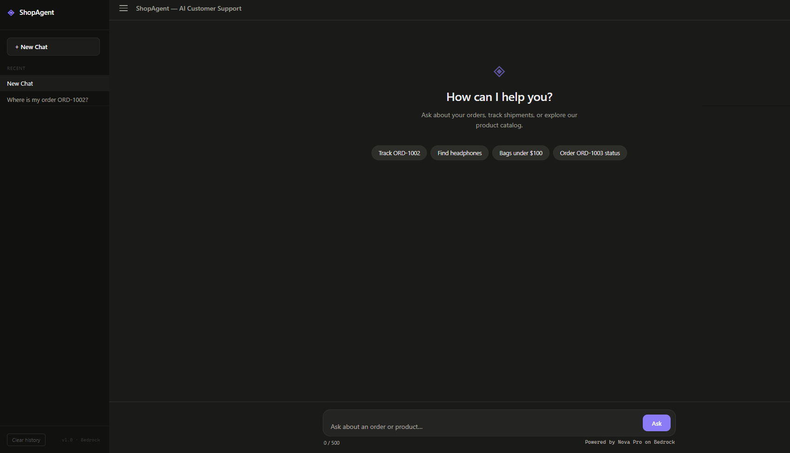
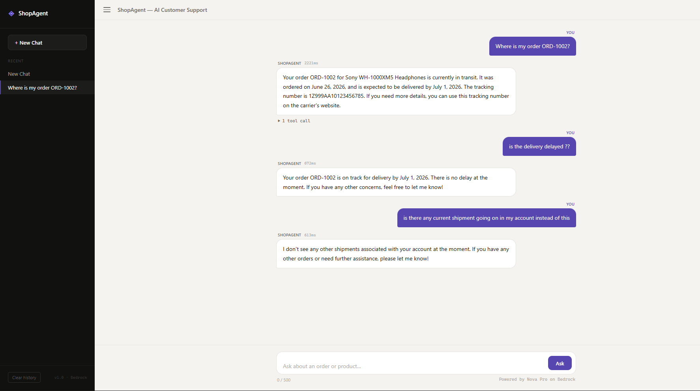
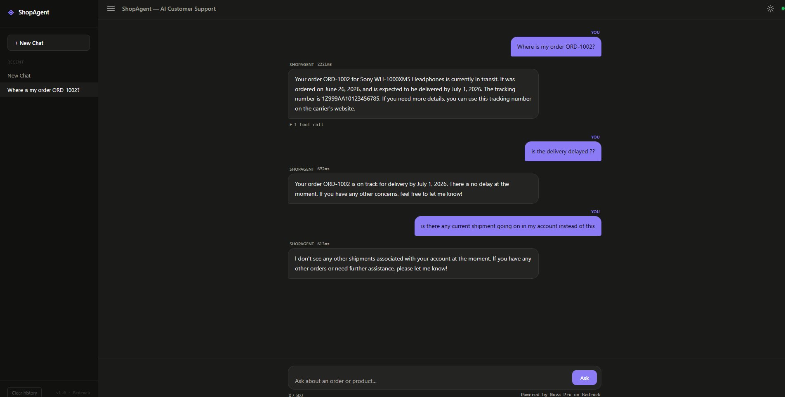

# 🛍️ ShopAgent — Agentic AI Customer Support

An AI-powered customer support chatbot built with **Amazon Bedrock (Nova Pro)**, **FastAPI**, and deployed as a **serverless application** on AWS Lambda. The agent autonomously decides which tools to call — looking up orders, searching products, and browsing categories — to deliver natural, human-friendly responses.

> **🔗 Live Demo:** [https://akkp7m0s45.execute-api.us-east-1.amazonaws.com/prod/](https://akkp7m0s45.execute-api.us-east-1.amazonaws.com/prod/)

---

## 📸 Screenshots

### Dark Mode — Welcome Screen


### Light Mode — Chat Conversation


### Dark Mode — Chat Conversation


---

## ✨ Features

| Feature | Details |
|---|---|
| **Agentic Tool Use** | The AI autonomously decides when to call `get_order`, `search_products`, `get_product`, or `get_categories` — no hardcoded if/else routing |
| **Multi-Turn Conversations** | Full conversation context is maintained across messages within a session |
| **Persistent Chat Threads** | All chat threads are saved in `localStorage` — refresh the page and your history stays intact |
| **Dark Mode** | One-click toggle with preference saved to `localStorage` |
| **Collapsible Sidebar** | Hamburger menu works on both desktop and mobile screens |
| **Tool Execution Trace** | Every response includes an expandable panel showing which tools were called, with their inputs and outputs |
| **System Prompt Guardrails** | The agent politely refuses off-topic questions (politics, general knowledge, etc.) and stays focused on customer support |
| **Serverless Deployment** | Runs on AWS Lambda + API Gateway — zero server management, pay-per-request |

---

## 🧠 The Thought Process — Why I Built It This Way

### The Core Problem

The assignment asked for a customer support agent that can answer questions about orders and products. The naive approach would be to dump all data into the system prompt and let the LLM figure it out. But that breaks immediately:

- **Context window limits** — Even 15 products and 5 orders eat up tokens fast. A real store has thousands.
- **Hallucination risk** — The model starts "remembering" prices and stock levels that don't exist.
- **No upgrade path** — You can't swap a system prompt for a real database later without rewriting everything.

So I chose the **agentic tool-use approach**: the model gets *no* data upfront. Instead, it gets a list of tools it can call. It reads the user's question, decides which tool to invoke, reads the result, and formulates a response. This is the same pattern used by production AI agents at scale.

### Why Amazon Nova Pro?

I evaluated the assignment requirements and chose Nova Pro on Bedrock because:

1. **Native tool-use support** — The Converse API has first-class `toolUse` and `toolResult` message types. No hacky prompt engineering to simulate function calling.
2. **Pay-per-token pricing** — Perfect for a demo project. Zero cost when nobody's using it.
3. **Low latency** — Responses typically arrive in 800–1500ms, which feels responsive in a chat UI.
4. **No API key management** — Bedrock uses IAM roles, so credentials are handled by the AWS SDK automatically.

### Why a Custom Agent Loop Instead of LangChain?

This was a deliberate decision. LangChain would have added ~50MB of dependencies and abstracted away the exact thing the assignment wants to demonstrate — *how an agent loop works*.

My custom loop in `agent.py` is ~80 lines and does exactly this:

```
1. Send user message + tool schemas to Bedrock
2. If the model returns tool_use blocks → execute each tool locally
3. Send tool results back as toolResult messages
4. Repeat until the model returns end_turn (or we hit 6 rounds)
5. Clean the final response (strip any leaked <thinking> tags)
```

This gives me full control over error handling, tracing, and response cleaning. Every tool call is recorded with its input and output, which powers the "tool trace" panel in the UI.

### Why FastAPI + Mangum (Not Flask, Not Express)?

The backend needed to serve two purposes:
- **Local development** — Run with `uvicorn` for hot-reloading during development
- **Production** — Run inside AWS Lambda for serverless deployment

**FastAPI** was the natural choice because it's async-first, has built-in request validation via Pydantic, and auto-generates API documentation. But the real magic is **Mangum** — a single-line adapter that converts AWS Lambda events into ASGI requests. This means the *exact same* FastAPI code runs locally and in production with zero changes.

```python
# lambda_handler.py — the entire file
from mangum import Mangum
from app.main import app
handler = Mangum(app)
```

### Why Vanilla HTML/CSS/JS (Not React)?

For a chat interface, React would have been overkill. It would add a build step, a `node_modules` folder, and complexity with no meaningful benefit. Instead:

- **Vanilla CSS with CSS custom properties** — All colors are defined as `--variables` in `:root`. Dark mode is just a `.dark-mode` class that overrides these variables. One toggle, every element updates instantly.
- **localStorage for persistence** — Chat threads are serialized to JSON and stored in the browser. No session database needed. Users can refresh the page, close the tab, or come back days later — their conversations are preserved.
- **Zero build step** — The HTML/CSS/JS files are served directly by FastAPI's `StaticFiles` middleware. No webpack, no bundler, no deployment pipeline for the frontend.

### The Evolution of the UI

The UI went through several iterations during development:

1. **V1 — Basic form** — A simple text input that returned JSON. Functional but ugly.
2. **V2 — Chat layout** — Added a sidebar, welcome screen, and suggestion chips. Messages were all left-aligned.
3. **V3 — Chat bubbles** — Switched to a left/right bubble layout (agent on the left, user on the right) to feel like a real messaging app.
4. **V4 — Thread history** — Added `localStorage`-backed chat threads so clicking an old conversation restores its full message history and tool traces.
5. **V5 — Dark mode + hamburger** — Added the theme toggle and made the sidebar collapsible on all screen sizes, not just mobile.

### How the Tool System Works

I designed the tools to be dead simple — pure Python functions with no side effects:

```python
def get_order(order_id: str) -> dict:     # Lookup by ID
def search_products(query: str) -> list:  # Keyword search
def get_product(product_id: str) -> dict: # Fetch by product ID
def get_categories() -> dict:             # List all categories
```

Each function is registered in two places:
1. **`TOOL_MAP`** — A Python dict mapping tool names to functions, so the agent loop can call them.
2. **`TOOL_CONFIG`** — A JSON schema sent to Bedrock, telling the model what tools exist, what parameters they accept, and when to use them.

The model reads the schema descriptions and autonomously decides which tool to call. For example, when a user asks *"Do you have noise-cancelling headphones?"*, the model:
1. Reads the `search_products` description: *"Search the product catalog by keyword"*
2. Calls `search_products(query="headphones")`
3. Gets back a list of matching products
4. Summarizes them in plain English

The model can also **chain tools**. If it calls `get_order` and the result contains a `product_id`, it might follow up with `get_product` to get full product details — all without being explicitly told to do so.

### Error Handling Philosophy

Errors are treated as *data*, not *exceptions*:

- **Order not found?** → `get_order()` returns `{"error": "Order not found"}`. The model reads this and tells the user naturally: *"I couldn't find that order."*
- **Unknown tool name?** → `TOOL_MAP.get()` returns `None`, and we return `{"error": "unknown tool"}`. The model recovers gracefully.
- **Bedrock API failure?** → The FastAPI endpoint catches the exception and returns HTTP 500. The frontend shows a red error card.

This approach means a missing order never crashes the application. The agent handles it like a real support agent would — by politely telling the user.

### Guardrails — Keeping the Agent on Topic

During testing, I discovered the agent would happily answer general knowledge questions ("Who is Donald Trump?") because Nova Pro is a general-purpose LLM. This is wrong for a customer support agent. I added a strict rule to the system prompt:

> *"You are ONLY permitted to answer questions related to the store, orders, shipping, and products. If a user asks an unrelated question, politely decline and steer back to store support."*

Now the agent responds to off-topic questions with something like: *"I'm designed to help with our store's products and orders. How can I assist you with your shopping?"*

### Deployment — Infrastructure as Code

The entire AWS infrastructure is defined in `template.yaml` (CloudFormation/SAM):

- **Lambda function** — Runs the FastAPI app with 512MB memory and a 30-second timeout
- **API Gateway** — HTTP API with a `{proxy+}` catch-all route
- **IAM Role** — Grants the Lambda permission to call Bedrock
- **S3 Bucket** — Stores deployment artifacts

Deployment is a two-command process:

```bash
python build.py    # Installs deps, copies source, creates zip
python deploy.py   # Uploads to S3, updates CloudFormation stack
```

No clicking through the AWS console. Everything is reproducible and version-controlled.

---

## 🏗️ Architecture

```
┌─────────────────────────────────────────────────────────────┐
│                        Frontend                             │
│         Vanilla HTML/CSS/JS  ·  Dark Mode  ·  localStorage  │
└──────────────────────────┬──────────────────────────────────┘
                           │  POST /ask
                           ▼
┌─────────────────────────────────────────────────────────────┐
│                    FastAPI Backend                           │
│             app/main.py  ·  Mangum (Lambda adapter)         │
└──────────────────────────┬──────────────────────────────────┘
                           │
                           ▼
┌─────────────────────────────────────────────────────────────┐
│                   Agent Loop (agent.py)                      │
│         Amazon Bedrock  ·  Nova Pro  ·  Converse API        │
│                                                             │
│    ┌──────────────────────────────────────────────────┐     │
│    │              Tool Selection                       │     │
│    │  ┌──────────────┐  ┌────────────────┐            │     │
│    │  │  get_order()  │  │search_products()│           │     │
│    │  └──────────────┘  └────────────────┘            │     │
│    │  ┌──────────────┐  ┌────────────────┐            │     │
│    │  │ get_product() │  │get_categories()│            │     │
│    │  └──────────────┘  └────────────────┘            │     │
│    └──────────────────────────────────────────────────┘     │
└──────────────────────────┬──────────────────────────────────┘
                           │
                           ▼
               Customer-Friendly Response
```

---

## 📁 Project Structure

```
shopagent/
├── agent/
│   ├── agent.py           # Bedrock Converse API loop with tool orchestration
│   └── tools.py           # Mock database: orders, products, categories
├── app/
│   ├── main.py            # FastAPI routes (/ask, static files)
│   └── static/
│       ├── index.html     # Chat UI
│       ├── style.css      # Light/Dark mode theming with CSS variables
│       └── app.js         # Frontend logic, chat threads, localStorage
├── tests/
│   └── test_tools.py      # 12 unit tests for all tool functions
├── lambda_handler.py      # AWS Lambda entry point (Mangum wrapper)
├── template.yaml          # SAM/CloudFormation infrastructure-as-code
├── build.py               # Packages Lambda deployment zip
├── deploy.py              # Deploys to AWS via CloudFormation
├── requirements.txt       # Python dependencies
├── design_decisions.md    # Detailed architectural rationale
└── README.md
```

---

## 🚀 Quick Start

### Prerequisites
- Python 3.11+
- AWS CLI configured with Bedrock access (`aws configure`)

### Run Locally

```bash
# 1. Install dependencies
pip install -r requirements.txt

# 2. Set your model (optional — defaults to Nova Pro)
set BEDROCK_MODEL_ID=amazon.nova-pro-v1:0

# 3. Start the dev server
uvicorn app.main:app --reload --port 8000

# 4. Open in browser
# http://localhost:8000
```

### Deploy to AWS

```bash
python build.py    # → Creates lambda_package.zip (20 MB)
python deploy.py   # → Deploys via CloudFormation to AWS Lambda + API Gateway
```

---

## 🧪 Running Tests

```bash
python -m pytest tests/ -v
```

**12 tests** covering all tool functions:

| Test | What it validates |
|---|---|
| `test_get_order_valid` | Returns correct order data for known IDs |
| `test_get_order_invalid` | Returns error for non-existent orders |
| `test_get_order_case_insensitive` | Handles `ord-1001` / `ORD-1001` |
| `test_search_products_*` | Keyword matching, empty results, multi-word queries |
| `test_get_product_valid` | Returns correct product by ID |
| `test_get_product_invalid` | Returns error for non-existent products |
| `test_get_categories` | Returns all 6 categories with counts and price ranges |

---

## 💬 Sample Interactions

**Q: Where is my order ORD-1002?**
> Your order ORD-1002 (Sony WH-1000XM5 Headphones) is currently in transit and expected to arrive soon. Tracking number: 1Z999AA10123456785.

**Q: Do you have noise-cancelling headphones?**
> Yes! We have two options: the Sony WH-1000XM5 at $279.99 (industry-leading ANC, 30hr battery) and the JBL Tune 760NC at $79.99 (35hr battery, great budget pick).

**Q: Show me bags under $100**
> We have two bags under $100: the Leather Tote Bag at $89.99 and the Canvas Backpack Pro at $54.99.

**Q: What categories do you have?**
> We carry products across 6 categories: Electronics (5 products), Accessories (3), Shoes (2), Apparel (2), Bags (2), and Home (1).

**Q: Who is the president?**
> I appreciate your curiosity, but I'm specifically designed to help with our store's products and orders. Is there anything I can help you with regarding your shopping experience?

---

## 🛠️ Tech Stack

| Layer | Technology | Why I Chose It |
|---|---|---|
| **LLM** | Amazon Nova Pro (Bedrock) | Native tool-use via Converse API, pay-per-token, no API keys needed |
| **Backend** | FastAPI + Python | Async-first, Pydantic validation, auto-generated docs at `/api/docs` |
| **Lambda Adapter** | Mangum | One-line bridge: same code runs locally with uvicorn and on Lambda |
| **Frontend** | Vanilla HTML/CSS/JS | Zero build step, instant load, CSS variables power the entire theme system |
| **Infrastructure** | AWS SAM / CloudFormation | Reproducible deployments, version-controlled, no console clicking |
| **Hosting** | AWS Lambda + API Gateway | $0 at idle, auto-scales, no servers to manage |

---

## 🔮 What I'd Improve With More Time

- **Streaming responses** — Bedrock supports streaming via `converse_stream`; combined with FastAPI's SSE support, the UI could show tokens as they arrive instead of waiting for the full response.
- **Real database** — Replace the Python dicts in `tools.py` with DynamoDB calls. The interface stays the same — only the function bodies change.
- **Authentication** — Add API Gateway + Cognito or a simple API key header to protect the endpoint.
- **Server-side chat history** — Move conversation storage from `localStorage` to DynamoDB per-user for cross-device persistence.
- **Step-by-step trace animation** — Animate the tool trace panel to show each step unfolding in real time as the agent thinks.

---

## 📄 License

This project was built as part of an academic assignment. All rights reserved.
